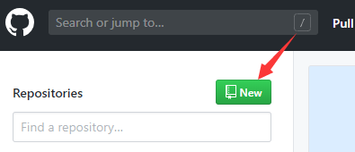
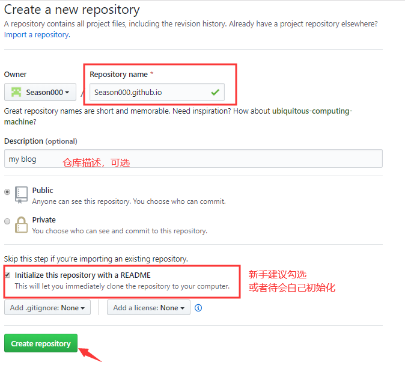
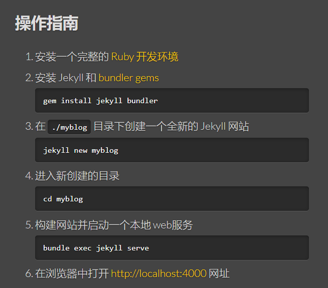

  
&emsp;&emsp;心血来潮想搭建一个博客，平台来来回回选了好几个，多多少少都有点广告影响阅读，寻觅过程中知道了GitHub page这个神器，于是开始了填坑之旅，写个文章记录下心得。

  
#GitHub page的使用方法

&emsp;&emsp;1.在Github上面新建一个仓库
首先你得有一个GitHub账户，注册过程就自行学习了，然后点击“new”新建一个仓库

&emsp;&emsp;2.仓库的名字设为XXX.github.io,"XXX"为你的用户名，如我的为Season000.github.io

&emsp;&emsp;3.至此为止，GitHub page搭建就完成了，已经可以在上面部署静态网页了，例如自己写一个静态的html，域名访问https://yourname.github.io/(yourname为你的用户名)便可以访问你的网页了。

&emsp;&emsp;对没错，在GitHub上面搭建自己的静态网页就这么简单，只要运用git相关知识，将仓库克隆到本地，在本地部署完自己的页面之后，在push到GitHub，就可以随时随地访问自己搭建的网站啦。难点不在这里，是下面在本地预览效果的步骤。

----------

#windows下jekyll的安装
&emsp;&emsp;GitHub page只支持静态网页，对于我这种对前端只有初步了解的小白而言，从零开始搭建自己的博客是几乎不可能的，于是乎就选择使用别人的模板，当下主流的使用的框架有jekyll和hexo两种，我选择了jekyll，至于为什么我也不知道，两个框架都不了解，官方建议是jekyll，就选择了前者，从此在采坑的路上一去不返。。。

&emsp;&emsp;因为GitHub page支持jekyll，所以只要部署上去就行，这里将本地代码部署到github上的方法暂不介绍，自行学习git基础知识，我们所要做的，就是在本地安装jekyll，来预览我们的博客效果，当效果符合自己的要求的时候，只要推到你的仓库，就可以访问了。

&emsp;&emsp;[jekyll](https://baike.baidu.com/item/jekyll/1164861?fr=aladdin)是一个简单的免费的Blog生成工具，Linux系统下的安装较简单，这里主要介绍windows下jekyll的安装心得

&emsp;&emsp;网上教程非常多，我试了好多，可谓遍地是坑，所以在这里建议的是，直接按照[jekyll官网安装步骤](https://www.jekyll.com.cn/docs/)的来！！！不要直接按照网上各种博客的教程，可以遇到问题再去搜索解决。

&emsp;&emsp;在安装jekyll之前，ruby，rubygems，gcc，make的环境一定要装好，否则出来的报错简直不忍直视

&emsp;&emsp;当所有的环境都安装好的时候，打开cmd，进入到你博客的文件夹将执行jekyll new myblog，在进入所创建的文件夹cd myblog，构建网站启动web服务bundle exec jekyll serve，这时候在浏览器打开127.0.0.1就能看到一个初始自带的jekyll主题了

----------

#选择主题
&emsp;&emsp;可以从[jekyll主题](http://jekyllthemes.org/)中选择自己喜欢的，download的到本地，就可以预览和修改各种主题了。

&emsp;&emsp;jekyll项目文件夹主要目录：
    
    .
    ├── _config.yml
    ├── _data
    |   └── members.yml
    ├── _drafts
    |   ├── begin-with-the-crazy-ideas.md
    |   └── on-simplicity-in-technology.md
    ├── _includes
    |   ├── footer.html
    |   └── header.html
    ├── _layouts
    |   ├── default.html
    |   └── post.html
    ├── _posts
    |   ├── 2007-10-29-why-every-programmer-should-play-nethack.md
    |   └── 2009-04-26-barcamp-boston-4-roundup.md
    ├── _sass
    |   ├── _base.scss
    |   └── _layout.scss
    ├── _site
    ├── .jekyll-metadata
    └── index.html # 也可以是带 front matter 的 'index.md' 文件
    
    _config.yml	jekyll的配置文件，jekyll的很多参数可以在输入命令行时直接输入，也可以写入配置文件，简化繁琐的命令输入过程。

    _drafts	这个文件夹里面是用来存放草稿的，里面的文件不需要在文件名中加入固定格式的日期前缀。

    _includes	这里面可以放置一些可重用的模块来加速开发，你可以方便的将里面的内容在多个文件里复用。譬如你也可以在多个页面中加入一块固定的模块，这个模块存放在文件_includes/file.ext，只需要在文件中插入liquid标签：  。

    _layouts	这个目录存放的是一些布局文件，我们的post文章里面可以使用YAML前缀格式来设置我们使用的布局。我们可以使用liquid标签 {{ content }} 在我们的web页中插入内容。

    _posts	这里是用来放置你的文章的，里面的文件需要加入日期前缀，格式为： YEAR-MONTH-DAY-title.MARKUP 。前面的日期格式是固定的，jekyll可以自动提取出文件名中的日期前缀用来标识文件发布的日期，这个日期可以用来排序，分类，显示等。

    _site	jekyll默认会将jekyll项目中的内容生成静态网页放到这个目录中，这个目录是可以自定义的，可以写到配置文件_config.yml中。默认这个目录会加入.gitignore文件中，里面的内容不会上传到github，github page会自动根据你上传的jekyll项目生成对应的网页，而不会直接展示你自己本地生成的网页。

    index.html	默认的主页文件，可以在文件头部加入YAML区域，内容中也可以加入Markdown等格式的内容。这个文件也会被jekyll转换成对应网页，不会直接显示你定义的内容。文件后缀可以是：.html, .markdown, .md, .textile 等。

 &emsp;&emsp;一个主题拿到手，我们只需要改一改网页title之类的，就可以为自己所用，之后我们在正常的写博客的过程中，只需要修改ports里面的markdown文件就行，一个文件为一篇博客，命名格式必须为时间开头，十分的方便

这是一篇有点粗糙的博客哈哈。。。。。
